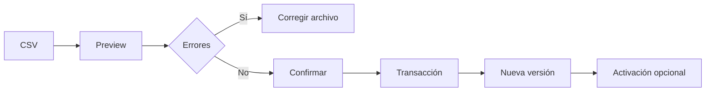

# Contratos CSV

## `entrenamiento_plan_v1`

- Codificación UTF-8.
- Separador `;`.
- Cabecera exacta y ordenada.
- Una única planificación y versión por archivo.
- Confirmación completa y transaccional; no admite importación parcial.
- Checksum SHA-256 y trabajo temporal antes de persistir el plan.

La plantilla vacía está en `contracts/entrenamiento_plan_v1.csv` y puede descargarse desde:

`GET /api/v1/import-schemas/training-plan/v1/template`

Columnas: `schema_version`, `plan_external_id`, `plan_name`, `plan_version`, `user_identifier`, `week_number`, `day_number`, `day_name`, `session_name`, `exercise_order`, `exercise_code`, `exercise_name`, `muscle_group`, `equipment`, `sets`, `reps_min`, `reps_max`, `target_rir`, `target_rpe`, `rest_seconds`, `tempo`, `warmup_required`, `superset_group`, `alternative_exercise_code`, `instructions`, `notes`, `valid_from`, `valid_until`.

Límites configurables: `IMPORT_MAX_FILE_SIZE`, `IMPORT_MAX_ROWS` e `IMPORT_JOB_TTL_HOURS`.
