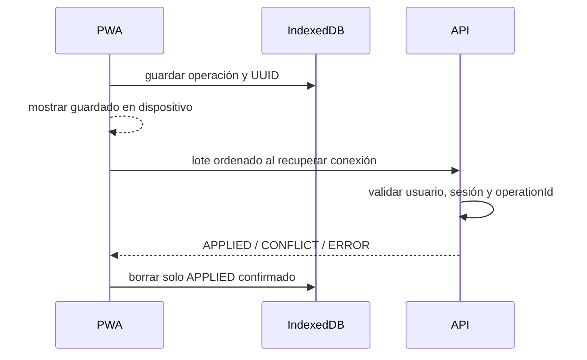

# Entrenamiento offline

Durante una sesión, la PWA guarda operaciones pendientes en IndexedDB con UUID de operación y entidad. Al volver la conexión envía el lote en orden; el servidor registra cada `operationId` y repetirlo devuelve el mismo resultado sin duplicar series.

El service worker solo cachea app shell y recursos estáticos del mismo origen. Nunca cachea `/api`, autenticación ni respuestas privadas. Al cerrar sesión se elimina IndexedDB de entrenamiento. El lote está limitado por `WORKOUT_SYNC_MAX_OPERATIONS`.
