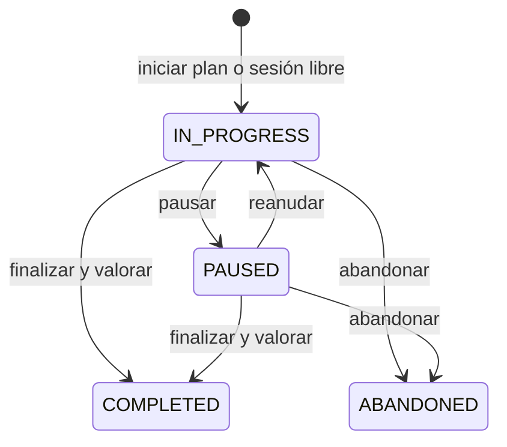

# Ejecución de entrenamientos

ANURA separa los registros legacy `tracker_entry` de las nuevas sesiones específicas. Una sesión conserva el plan, su versión, el día y un snapshot de los objetivos de cada ejercicio; una importación posterior nunca altera el histórico.

Las series admiten fuerza, cardio, movilidad e isométricos mediante campos opcionales. El volumen solo se calcula cuando existen carga y repeticiones. El 1RM estimado usa Epley (`peso × (1 + repeticiones / 30)`) hasta el máximo configurable; es una estimación deportiva, no clínica.

Los récords se relacionan con la serie fuente, evitando duplicados. Una sustitución conserva ejercicio original, sustituto y motivo sin modificar el plan. Ante dolor, ANURA registra datos y muestra un aviso prudente, sin diagnóstico.

Las sesiones nuevas aparecen primero en Entrenamiento. Los `tracker_entry` de tipo `WORKOUT` permanecen accesibles como registros anteriores y no se convierten automáticamente ni se suman dos veces.
